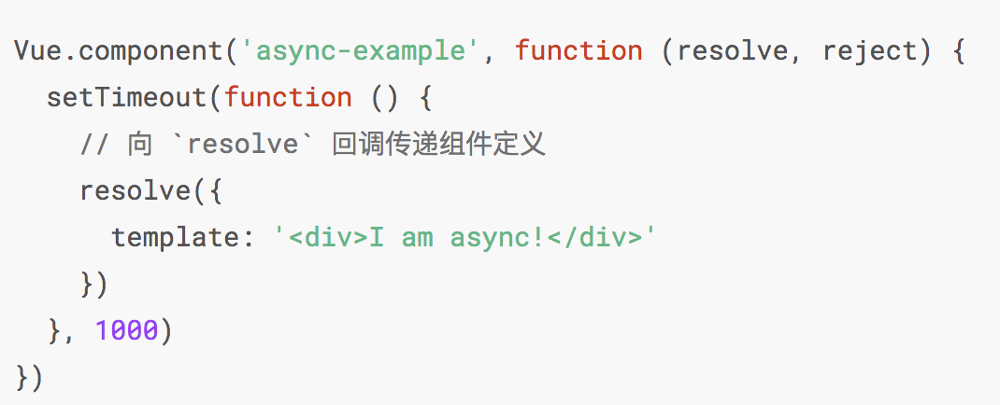
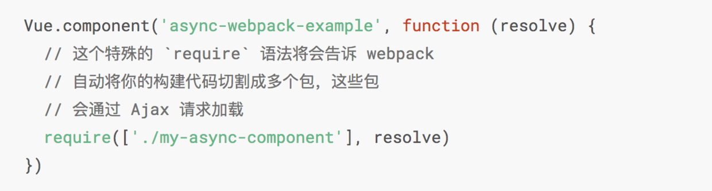
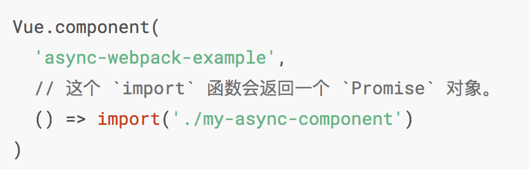
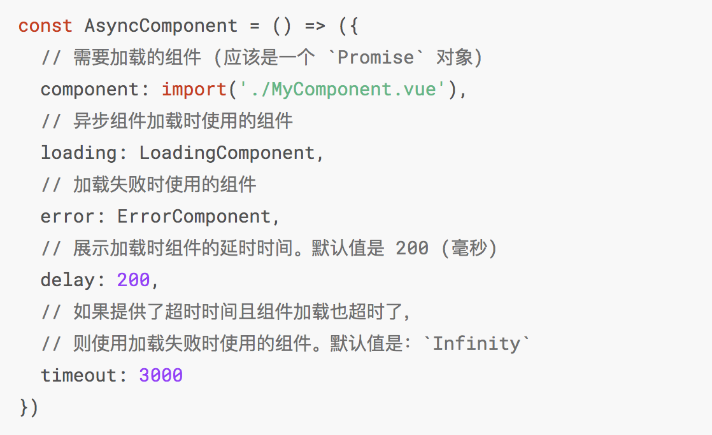
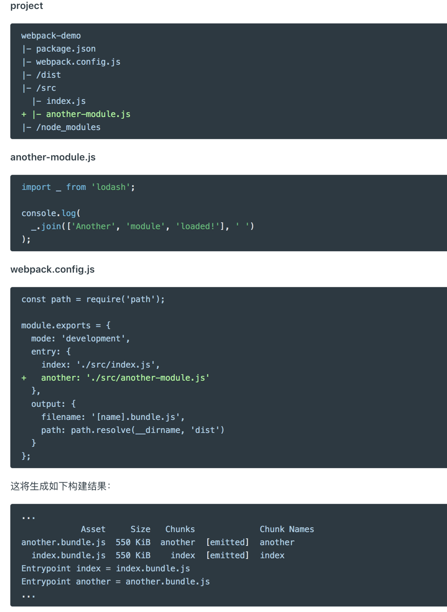
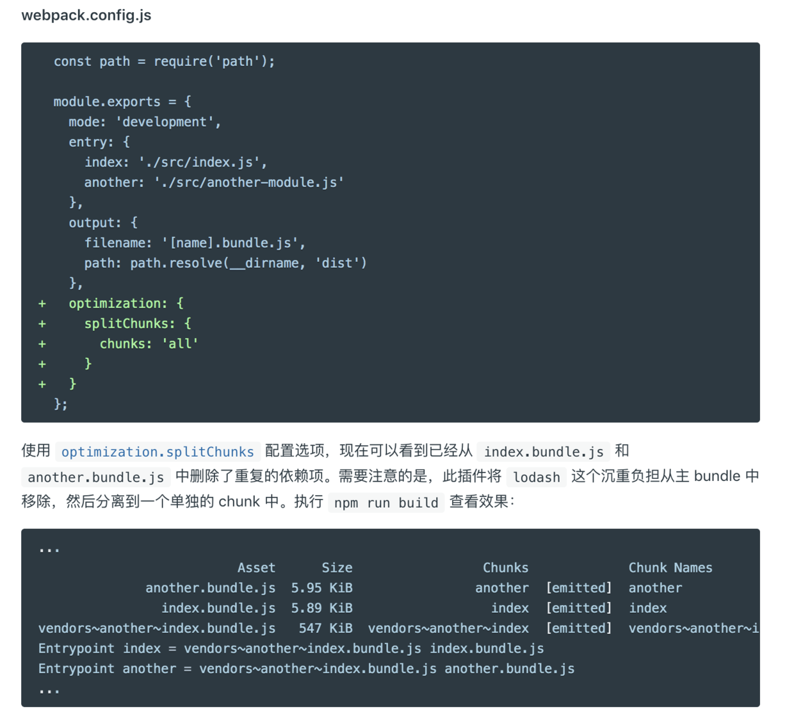

**把不同的路由对应的组件分割成不同的代码块，然后当路由被访问的时候才加载对应的组件即为路由的懒加载，可以加快项目的加载速度，提高效率。** 结合 Vue 的异步组件和 Webpack 的代码分割功能，轻松实现路由组件的懒加载。

- 异步组件
     1. 在大型应用中，将应用分割成小一些的代码块，只在需要的时候从服务器加载一个模块。为了简化，vue允许以一个工厂函数的方式定义组件，该工厂函数会异步解析组件定义。vue只有在该组件被需要渲染的时候才会触发该工厂函数，把结果缓存起来供未来重渲染。  


	2. 该工厂函数会收到一个resolve回调，这个回调函数会在得到服务器命令(组件定义的时候)被调用，可以调用 reject(reason) 来表示加载失败。如何获取组件取决于你自己。一个推荐的做法是将异步组件和 webpack 的 code-splitting 功能一起配合使用：


	3. 可以在工厂函数中返回一个Promise：


	4.  异步组件工厂函数也可以返回一个如下格式的对象：


- 代码分割功能（webpack）
   能够把代码分离到不同的bundle中，然后可以按需加载或并行加载这些文件。代码分离可以获取更小的bundle，以及控制资源加载优先级。常用的代码分离有三种方式：
   
   1. 入口起点：使用entry配置手动分离代码（虽然简单直观，但是不够灵活，并且不能动态地将核心应用程序逻辑中的代码拆分出来）


	2. 防止重复：使用SplitChunkPlugin插件去重合分离chunk（将公共的依赖模块提取到已有的 entry chunk 中，或者提取到一个新生成的 chunk。）使用 optimization.splitChunks 配置选项，现在可以看到已经从 index.bundle.js 和 another.bundle.js 中删除了重复的依赖项。


	3. 动态导入：通过模块中的内联函数调用分离代码。涉及到动态代码拆分时，webpack提供了两个类似的技术（import（）实现动态导入；webpack特定的require.ensure）
	[webpack 文档](https://webpack.docschina.org/guides/code-splitting/)
	
- 路由懒加载

	

``` javascript
		const Foo = () => import('./Foo.vue')
        const router = new VueRouter({ routes: [ { path: '/foo', component: Foo } ]})
        有时候想把某个路由下的所有组件都打包在同一个异步快中，需要使用命名chunk，一个特殊的注释语法来提供chunk name（webpack>2.4）
        const Foo = () => import(/* webpackChunkName: "group-foo" */ './Foo.vue')
```